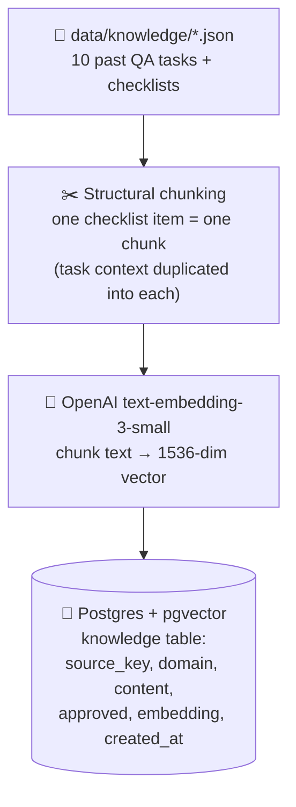
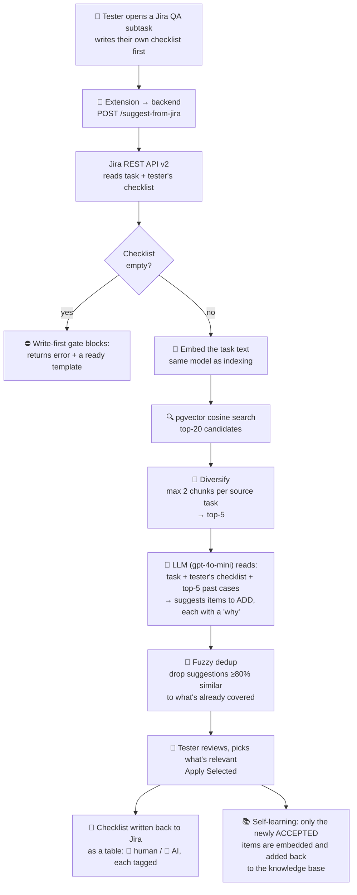

# Architecture

Technical deep-dive: how the indexing and retrieval pipelines actually work.

---

## Indexing pipeline (runs once, or whenever the knowledge base is rebuilt)



**Why one chunk per checklist item, not one chunk per task.** Packing an entire task's checklist into a single vector blurs its meaning — the vector becomes an average of several distinct concerns (rollback, concurrency, audit logging), which hurts retrieval precision. Splitting per item and re-attaching the task context to *each* chunk keeps every vector focused on one testable concern, while never losing the business context that gives it meaning.

**Why duplicate the task text into every chunk instead of storing it once.** A chunk containing only `"Rollback: if putaway confirmation fails, stock remains consistent"` is retrievable, but semantically ambiguous — nothing ties it to warehouse transfers specifically. Duplicating the task description into each chunk "soaks" the vector in context, so a new query about a similar task finds it. It's a blunt, code-level join (not a smart NLP alignment step) — deliberately simple and robust rather than clever and fragile.

---

## Query pipeline (runs on every "Generate Checklist" click)



**Retrieval is two-stage, not one shot.** Stage one is pure vector similarity (cosine distance) — cheap, fast, but can let one dominant past task crowd out everything else. Stage two, diversification, caps how many chunks come from any single source before the final top-5 is handed to the LLM. Without it, retrieval can — and did, during development — return five near-duplicate chunks from one task while missing two other genuinely relevant tasks in different domains. A related bug and its fix (an overly strict domain filter that excluded cross-domain matches) is documented in the [README](./README.md#3-a-real-bug-found-and-fixed-the-domain-filter).

**The LLM's role is synthesis, not citation.** It doesn't just paste retrieved checklist lines back verbatim — it checks what the tester already covered, adapts the wording of a retrieved pattern to the new task's terminology, and explains *why* each suggestion matters, tracing it back to a specific past case. Grounded in retrieved facts, but not a copy-paste — closer to an editor than a ghost-writer.

**Why the tester decides, not the model.** The system can tell two tasks are semantically close and that a past case included a certain check. It cannot know whether the new environment is actually built the same way — whether it has the same hardware, the same failure modes, the same business rules. That judgment call stays with the human; the tool's job is to make sure nothing gets forgotten, not to make the call itself.

---

## Storage: the `knowledge` table

```sql
CREATE EXTENSION IF NOT EXISTS vector;

CREATE TABLE knowledge (
    id            BIGSERIAL PRIMARY KEY,
    source_key    TEXT,                 -- Jira issue key the chunk came from
    domain        TEXT,                 -- metadata only, not a hard filter (see above)
    content       TEXT NOT NULL,        -- the chunk text
    approved      BOOLEAN DEFAULT TRUE, -- quality gate for retrieval
    embedding     VECTOR(1536),         -- must match the embedding model's output size
    created_at    TIMESTAMPTZ DEFAULT now()
);

CREATE INDEX knowledge_embedding_idx
    ON knowledge USING ivfflat (embedding vector_cosine_ops) WITH (lists = 100);
```

`VECTOR(1536)` is a type added by the pgvector extension — a fixed-length array of floats, plus operators (`<=>` for cosine distance) that plain Postgres doesn't have. `1536` is not arbitrary: it's the output size of `text-embedding-3-small`; switching embedding models means recreating this column with a matching dimension.

The `ivfflat` index clusters vectors into buckets (`lists = 100`) so a search only has to scan the nearest bucket instead of every row — the standard approximate-nearest-neighbor trade-off (a little precision for a lot of speed). At this project's demo scale (81 rows) the planner likely ignores it and just scans the table; the index exists to show the pattern that matters once the knowledge base grows to thousands of rows.

---

## Parameters

| Parameter | Value | Where |
|---|---|---|
| Embedding model | `text-embedding-3-small` | `config.py` / `.env` |
| Embedding dimension | 1536 | `config.py` |
| Generation model | `gpt-4o-mini` | `config.py` / `.env` |
| Candidates before diversification | 20 | `config.py` (`RETRIEVE_N`) |
| Final examples sent to the LLM | 5 | `config.py` (`TOP_K`) |
| Max chunks from one source | 2 | `config.py` (`MAX_PER_SOURCE`) |
| Dedup similarity threshold | 0.80 | `rag_pipeline.py` (`_is_duplicate`) |
